# Core Framework Backend Flow Diagrams

This document is a shared frontend/backend flow map for the core user-management backend.
It complements:

- [API_Documentation.openapi.yaml](API_Documentation.openapi.yaml), the canonical API contract
- [API_Documentation.md](API_Documentation.md), the human-readable API guide
- [Database_Guide.md](Database_Guide.md), the database design guide

The backend uses `axum`, `sqlx`, PostgreSQL, JWT access tokens, refresh cookies, CSRF protection on refresh, and local signed file-transfer routes for development.

## How To Read These Diagrams

- Public API routes are mounted under `/api/v1`.
- `GET /api/v1/health` lives inside the versioned public API.
- `/internal/uploads/*` and `/internal/files/*` are signed local transfer helpers, not stable public API routes.
- Most responses use `ApiEnvelope<T>` with `data` and `meta.requestId`.
- Error responses use `ErrorEnvelope` with `error.code`, `error.message`, `error.urgencyLevel`, and `error.requestId`.
- Protected operations start by requiring `Authorization: Bearer <accessToken>`.
- Session refresh requires `refresh_token` and `csrf_token` cookies plus `X-CSRF-Token`.

## C4 Level 1: System Context

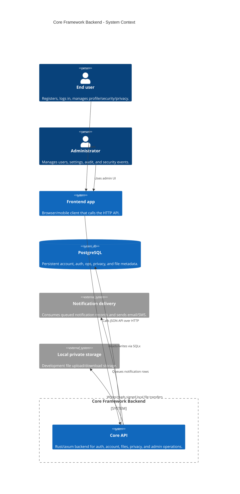
```mermaid
C4Context
    title Core Framework Backend - System Context
    Person(end_user, "End user", "Registers, logs in, manages profile/security/privacy.")
    Person(admin_user, "Administrator", "Manages users, settings, audit, and security events.")
    System(frontend, "Frontend app", "Browser/mobile client that calls the HTTP API.")
    System_Boundary(core_boundary, "Core Framework Backend") {
        System(core_api, "Core API", "Rust/axum backend for auth, account, files, privacy, and admin operations.")
    }
    SystemDb(postgres, "PostgreSQL", "Persistent account, auth, ops, privacy, and file metadata.")
    System_Ext(notification_worker, "Notification delivery", "Consumes queued notification records and sends email/SMS.")
    System_Ext(local_storage, "Local private storage", "Development file upload/download storage.")

    Rel(end_user, frontend, "Uses")
    Rel(admin_user, frontend, "Uses admin UI")
    Rel(frontend, core_api, "Calls JSON API over HTTP")
    Rel(core_api, postgres, "Reads/writes via SQLx")
    Rel(core_api, notification_worker, "Queues notification rows")
    Rel(core_api, local_storage, "Writes/reads signed local file transfers")
```

## C4 Level 2: Container Diagram

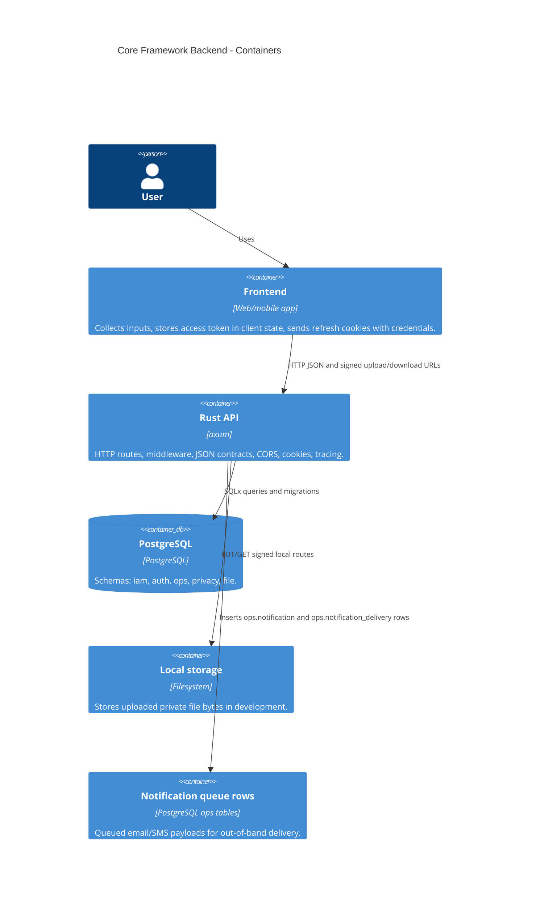
```mermaid
C4Container
    title Core Framework Backend - Containers
    Person(user, "User")
    Container(frontend, "Frontend", "Web/mobile app", "Collects inputs, stores access token in client state, sends refresh cookies with credentials.")
    Container(api, "Rust API", "axum", "HTTP routes, middleware, JSON contracts, CORS, cookies, tracing.")
    ContainerDb(db, "PostgreSQL", "PostgreSQL", "Schemas: iam, auth, ops, privacy, file.")
    Container(storage, "Local storage", "Filesystem", "Stores uploaded private file bytes in development.")
    Container(notifications, "Notification queue rows", "PostgreSQL ops tables", "Queued email/SMS payloads for out-of-band delivery.")

    Rel(user, frontend, "Uses")
    Rel(frontend, api, "HTTP JSON and signed upload/download URLs")
    Rel(api, db, "SQLx queries and migrations")
    Rel(api, storage, "PUT/GET signed local routes")
    Rel(api, notifications, "Inserts ops.notification and ops.notification_delivery rows")
```

## C4 Level 3: Component Diagram

```mermaid
C4Component
    title Core Framework Backend - API Components
    Container_Boundary(api, "Rust API") {
        Component(router, "build_router", "src/lib.rs", "Mounts route groups, middleware, CORS, cookies, tracing.")
        Component(request_context, "Request context middleware", "src/request_context.rs", "Adds request ID, IP, and user agent to request extensions and response headers.")
        Component(auth_guard, "Auth helpers", "src/auth.rs", "JWT, cookies, CSRF, password hashing, TOTP, signed URLs, auth context.")
        Component(auth_routes, "Auth routes", "src/api/auth_routes.rs", "Registration, invitation use, multi-key login, password policy, email verification, MFA, passkey login.")
        Component(user_routes, "User routes", "src/api/users.rs", "Profile, sessions, security, passkeys, TOTP, emails, phones.")
        Component(file_routes, "File routes", "src/api/files.rs + src/api/internal.rs", "Signed private upload/download flow.")
        Component(privacy_routes, "Privacy routes", "src/api/privacy.rs", "Legal documents, consent, privacy requests, cookies.")
        Component(admin_routes, "Admin routes", "src/api/admin.rs", "Admin overview, users, invitations, password policy, roles, settings, security, audit.")
        Component(auth_service, "Auth service", "src/services/auth.rs", "Account creation, invitation consumption, sessions, password policy enforcement, MFA, passkey login.")
        Component(user_service, "User service", "src/services/user.rs", "Self-service profile/security/contact operations.")
        Component(file_service, "File service", "src/services/files.rs", "Upload intents, local upload validation, download URLs.")
        Component(privacy_service, "Privacy service", "src/services/privacy.rs", "Consent, cookie preferences, legal documents, data subject requests.")
        Component(admin_service, "Admin service", "src/services/admin.rs", "Admin user/settings/status, generated account text, invitations, password-policy operations.")
        Component(shared_service, "Shared service", "src/services/shared.rs", "Reusable loaders, settings, audit, security events, notifications, lists.")
    }
    ContainerDb(db, "PostgreSQL", "iam/auth/ops/privacy/file schemas")
    Container(storage, "Local storage", "Filesystem")

    Rel(router, request_context, "Runs")
    Rel(router, auth_routes, "Merges")
    Rel(router, user_routes, "Merges")
    Rel(router, file_routes, "Merges")
    Rel(router, privacy_routes, "Merges")
    Rel(router, admin_routes, "Merges")
    Rel(auth_routes, auth_service, "Calls")
    Rel(user_routes, user_service, "Calls")
    Rel(file_routes, file_service, "Calls")
    Rel(privacy_routes, privacy_service, "Calls")
    Rel(admin_routes, admin_service, "Calls")
    Rel(auth_routes, auth_guard, "Uses for protected auth routes")
    Rel(user_routes, auth_guard, "Uses")
    Rel(file_routes, auth_guard, "Uses")
    Rel(privacy_routes, auth_guard, "Uses optional/required auth")
    Rel(admin_routes, auth_guard, "Uses admin auth")
    Rel(auth_service, shared_service, "Loads profiles/settings and records events")
    Rel(user_service, shared_service, "Loads profiles/lists and records events")
    Rel(admin_service, shared_service, "Loads admin summaries and records audit")
    Rel(shared_service, db, "Queries")
    Rel(auth_service, db, "Queries")
    Rel(user_service, db, "Queries")
    Rel(file_service, db, "Queries")
    Rel(privacy_service, db, "Queries")
    Rel(admin_service, db, "Queries")
    Rel(file_service, storage, "Reads/writes bytes")
```

## C4 Level 4: Code-Level View

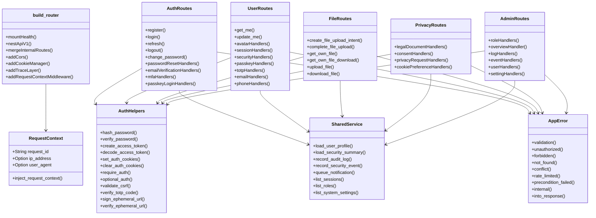
```mermaid
classDiagram
    class build_router {
      +mountHealth()
      +nestApiV1()
      +mergeInternalRoutes()
      +addCors()
      +addCookieManager()
      +addTraceLayer()
      +addRequestContextMiddleware()
    }
    class RequestContext {
      +String request_id
      +Option ip_address
      +Option user_agent
      +inject_request_context()
    }
    class AuthHelpers {
      +hash_password()
      +verify_password()
      +create_access_token()
      +decode_access_token()
      +set_auth_cookies()
      +clear_auth_cookies()
      +require_auth()
      +optional_auth()
      +validate_csrf()
      +verify_totp_code()
      +sign_ephemeral_url()
      +verify_ephemeral_url()
    }
    class AuthRoutes {
      +register()
      +login()
      +refresh()
      +logout()
      +change_password()
      +passwordResetHandlers()
      +emailVerificationHandlers()
      +mfaHandlers()
      +passkeyLoginHandlers()
    }
    class UserRoutes {
      +get_me()
      +update_me()
      +avatarHandlers()
      +sessionHandlers()
      +securityHandlers()
      +passkeyHandlers()
      +totpHandlers()
      +emailHandlers()
      +phoneHandlers()
    }
    class FileRoutes {
      +create_file_upload_intent()
      +complete_file_upload()
      +get_own_file()
      +get_own_file_download()
      +upload_file()
      +download_file()
    }
    class PrivacyRoutes {
      +legalDocumentHandlers()
      +consentHandlers()
      +privacyRequestHandlers()
      +cookiePreferenceHandlers()
    }
    class AdminRoutes {
      +roleHandlers()
      +overviewHandler()
      +logHandlers()
      +eventHandlers()
      +userHandlers()
      +settingHandlers()
    }
    class SharedService {
      +load_user_profile()
      +load_security_summary()
      +record_audit_log()
      +record_security_event()
      +queue_notification()
      +list_sessions()
      +list_roles()
      +list_system_settings()
    }
    class AppError {
      +validation()
      +unauthorized()
      +forbidden()
      +not_found()
      +conflict()
      +rate_limited()
      +precondition_failed()
      +internal()
      +into_response()
    }

    build_router --> RequestContext
    AuthRoutes --> AuthHelpers
    UserRoutes --> AuthHelpers
    FileRoutes --> AuthHelpers
    PrivacyRoutes --> AuthHelpers
    AdminRoutes --> AuthHelpers
    AuthRoutes --> SharedService
    UserRoutes --> SharedService
    FileRoutes --> SharedService
    PrivacyRoutes --> SharedService
    AdminRoutes --> SharedService
    AuthRoutes --> AppError
    UserRoutes --> AppError
    FileRoutes --> AppError
    PrivacyRoutes --> AppError
    AdminRoutes --> AppError
```

## Shared Request Flow

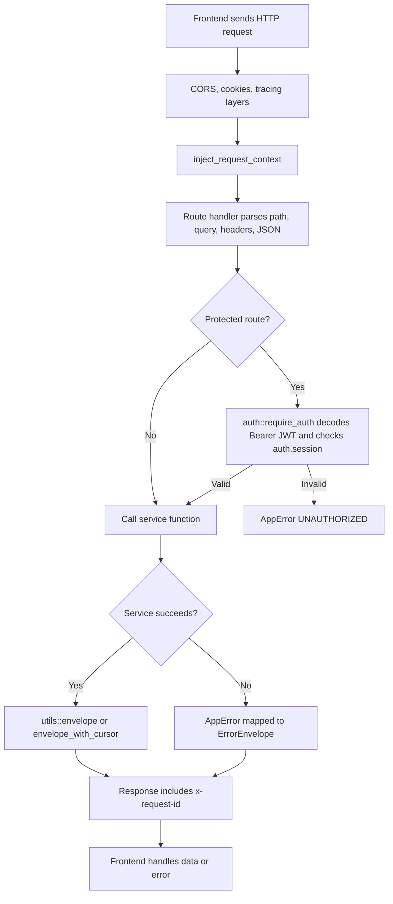
```mermaid
flowchart TD
    A[Frontend sends HTTP request] --> B[CORS, cookies, tracing layers]
    B --> C[inject_request_context]
    C --> D[Route handler parses path, query, headers, JSON]
    D --> E{Protected route?}
    E -->|No| F[Call service function]
    E -->|Yes| G[auth::require_auth decodes Bearer JWT and checks auth.session]
    G -->|Valid| F
    G -->|Invalid| X[AppError UNAUTHORIZED]
    F --> H{Service succeeds?}
    H -->|Yes| I[utils::envelope or envelope_with_cursor]
    H -->|No| J[AppError mapped to ErrorEnvelope]
    I --> K[Response includes x-request-id]
    J --> K
    K --> L[Frontend handles data or error]
```

## Shared Error Flow

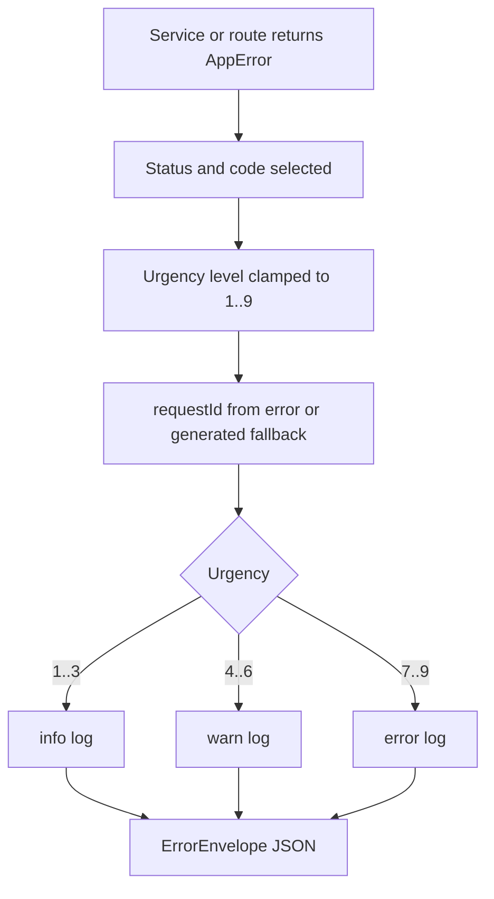
```mermaid
flowchart TD
    A[Service or route returns AppError] --> B[Status and code selected]
    B --> C[Urgency level clamped to 1..9]
    C --> D[requestId from error or generated fallback]
    D --> E{Urgency}
    E -->|1..3| F[info log]
    E -->|4..6| G[warn log]
    E -->|7..9| H[error log]
    F --> I[ErrorEnvelope JSON]
    G --> I
    H --> I
```

## Route-To-Service Map

| Area | Route | Handler | Service entry point |
| --- | --- | --- | --- |
| Health | `GET /api/v1/health` | `api::health` | direct acknowledgement |
| Auth | `POST /api/v1/auth/register` | `auth_routes::register` | `services::auth::register` |
| Auth | `POST /api/v1/auth/register-admin` | `auth_routes::register_admin` | `services::auth::register_admin_bootstrap` |
| Auth | `POST /api/v1/auth/login` | `auth_routes::login` | `services::auth::login` |
| Auth | `POST /api/v1/auth/refresh` | `auth_routes::refresh` | `services::auth::refresh_session` |
| Auth | `POST /api/v1/auth/logout` | `auth_routes::logout` | `services::auth::logout` |
| Auth | `POST /api/v1/auth/password/change` | `auth_routes::change_password` | `services::auth::change_password` |
| Auth | `GET /api/v1/auth/password/policy` | `auth_routes::get_password_policy` | `services::auth::load_password_policy` |
| Auth | `POST /api/v1/auth/password/forgot` | `auth_routes::start_password_reset` | `services::auth::start_password_reset` |
| Auth | `POST /api/v1/auth/password/reset` | `auth_routes::complete_password_reset` | `services::auth::complete_password_reset` |
| Auth | `POST /api/v1/auth/email/verify` | `auth_routes::verify_email_challenge` | `services::auth::verify_email_challenge` |
| Auth | `POST /api/v1/auth/email/resend` | `auth_routes::resend_primary_email_verification` | `services::auth::resend_primary_email_verification` |
| Auth | `POST /api/v1/auth/mfa/verify` | `auth_routes::verify_mfa_challenge` | `services::auth::verify_mfa_challenge` |
| Auth | `POST /api/v1/auth/passkeys/authentication/options` | `auth_routes::create_passkey_authentication_options` | `services::auth::create_passkey_authentication_options` |
| Auth | `POST /api/v1/auth/passkeys/authentication/verify` | `auth_routes::verify_passkey_authentication` | `services::auth::verify_passkey_authentication` |
| Profile | `GET /api/v1/me` | `users::get_me` | `services::user::get_me` |
| Profile | `PATCH /api/v1/me` | `users::update_me` | `services::user::update_me` |
| Profile | `POST /api/v1/me/avatar` | `users::set_avatar` | `services::user::set_avatar` |
| Profile | `DELETE /api/v1/me/avatar` | `users::remove_avatar` | `services::user::remove_avatar` |
| Account | `POST /api/v1/me/account/deactivate` | `users::deactivate_own_account` | `services::user::deactivate_own_account` |
| Sessions | `GET /api/v1/me/sessions` | `users::list_own_sessions` | `services::user::list_own_sessions` |
| Sessions | `POST /api/v1/me/sessions/revoke-all` | `users::revoke_all_own_sessions` | `services::user::revoke_all_own_sessions` |
| Sessions | `DELETE /api/v1/me/sessions/{sessionId}` | `users::revoke_own_session` | `services::user::revoke_own_session` |
| Security | `GET /api/v1/me/security` | `users::get_security_summary` | `services::user::get_security_summary` |
| Security | `GET /api/v1/me/security/events` | `users::list_own_security_events` | `services::user::list_own_security_events` |
| Security | `POST /api/v1/me/security/reports` | `users::create_security_report` | `services::user::create_security_report` |
| Passkeys | `GET /api/v1/me/passkeys` | `users::list_passkeys` | `services::user::list_passkeys` |
| Passkeys | `POST /api/v1/me/passkeys/registration/options` | `users::create_passkey_registration_options` | `services::user::create_passkey_registration_options` |
| Passkeys | `POST /api/v1/me/passkeys/registration/verify` | `users::verify_passkey_registration` | `services::user::verify_passkey_registration` |
| Passkeys | `DELETE /api/v1/me/passkeys/{passkeyId}` | `users::delete_passkey` | `services::user::delete_passkey` |
| TOTP | `POST /api/v1/me/mfa/totp/setup` | `users::create_totp_setup` | `services::user::create_totp_setup` |
| TOTP | `POST /api/v1/me/mfa/totp/enable` | `users::enable_totp` | `services::user::enable_totp` |
| TOTP | `POST /api/v1/me/mfa/totp/disable` | `users::disable_totp` | `services::user::disable_totp` |
| TOTP | `POST /api/v1/me/mfa/recovery-codes/rotate` | `users::rotate_recovery_codes` | `services::user::rotate_recovery_codes` |
| Emails | `GET /api/v1/me/emails` | `users::list_emails` | `services::user::list_emails` |
| Emails | `POST /api/v1/me/emails` | `users::create_email` | `services::user::create_email` |
| Emails | `DELETE /api/v1/me/emails/{emailId}` | `users::delete_email` | `services::user::delete_email` |
| Emails | `POST /api/v1/me/emails/{emailId}/verify` | `users::verify_email` | `services::user::verify_email` |
| Emails | `POST /api/v1/me/emails/{emailId}/make-primary` | `users::make_email_primary` | `services::user::make_email_primary` |
| Emails | `POST /api/v1/me/emails/{emailId}/resend-verification` | `users::resend_email_verification` | `services::user::resend_email_verification` |
| Emails | `POST /api/v1/me/email-change-requests` | `users::create_email_change_request` | `services::user::create_email_change_request` |
| Phones | `GET /api/v1/me/phones` | `users::list_phones` | `services::user::list_phones` |
| Phones | `POST /api/v1/me/phones` | `users::create_phone` | `services::user::create_phone` |
| Phones | `DELETE /api/v1/me/phones/{phoneId}` | `users::delete_phone` | `services::user::delete_phone` |
| Phones | `POST /api/v1/me/phones/{phoneId}/verify` | `users::verify_phone` | `services::user::verify_phone` |
| Phones | `POST /api/v1/me/phones/{phoneId}/make-primary` | `users::make_phone_primary` | `services::user::make_phone_primary` |
| Files | `POST /api/v1/files/uploads` | `files::create_file_upload_intent` | `services::files::create_file_upload_intent` |
| Files | `POST /api/v1/files/uploads/{fileId}/complete` | `files::complete_file_upload` | `services::files::complete_file_upload` |
| Files | `GET /api/v1/me/files/{fileId}` | `files::get_own_file` | `services::files::get_own_file` |
| Files | `GET /api/v1/me/files/{fileId}/download` | `files::get_own_file_download` | `services::files::get_own_file_download` |
| Internal files | `PUT /internal/uploads/{fileId}` | `internal::upload_file` | `services::files::accept_internal_upload` |
| Internal files | `GET /internal/files/{fileId}` | `internal::download_file` | `services::files::serve_internal_download` |
| Privacy | `GET /api/v1/legal/documents` | `privacy::list_legal_documents` | `services::privacy::list_legal_documents` |
| Privacy | `GET /api/v1/me/privacy-consents` | `privacy::list_privacy_consents` | `services::privacy::list_privacy_consents` |
| Privacy | `POST /api/v1/me/privacy-consents` | `privacy::create_privacy_consents` | `services::privacy::create_privacy_consents` |
| Privacy | `GET /api/v1/me/privacy-requests` | `privacy::list_privacy_requests` | `services::privacy::list_privacy_requests` |
| Privacy | `POST /api/v1/me/privacy-requests` | `privacy::create_privacy_request` | `services::privacy::create_privacy_request` |
| Privacy | `GET /api/v1/me/privacy-requests/{privacyRequestId}` | `privacy::get_privacy_request` | `services::privacy::get_privacy_request` |
| Privacy | `GET /api/v1/privacy/cookie-preferences` | `privacy::get_cookie_preferences` | `services::privacy::get_cookie_preferences` |
| Privacy | `PUT /api/v1/privacy/cookie-preferences` | `privacy::set_cookie_preferences` | `services::privacy::set_cookie_preferences` |
| Admin | `GET /api/v1/admin/roles` | `admin::list_roles` | `services::admin::list_roles` |
| Admin | `GET /api/v1/admin/overview` | `admin::get_admin_overview` | `services::admin::admin_overview` |
| Admin | `POST /api/v1/admin/invitations` | `admin::create_admin_invitations` | `services::admin::create_admin_invitations` |
| Admin | `GET /api/v1/admin/password-policy` | `admin::get_admin_password_policy` | `services::admin::get_password_policy` |
| Admin | `PATCH /api/v1/admin/password-policy` | `admin::update_admin_password_policy` | `services::admin::update_password_policy` |
| Admin | `GET /api/v1/admin/audit-logs` | `admin::list_audit_logs` | `services::admin::list_audit_logs` |
| Admin | `GET /api/v1/admin/security/events` | `admin::list_security_events` | `services::admin::list_security_events` |
| Admin | `GET /api/v1/admin/users` | `admin::list_admin_users` | `services::admin::list_admin_users` |
| Admin | `POST /api/v1/admin/users` | `admin::create_admin_user` | `services::admin::create_admin_user` |
| Admin | `GET /api/v1/admin/users/{accountId}` | `admin::get_admin_user` | `services::admin::get_admin_user` |
| Admin | `PATCH /api/v1/admin/users/{accountId}` | `admin::update_admin_user` | `services::admin::update_admin_user` |
| Admin | `GET /api/v1/admin/users/{accountId}/sessions` | `admin::list_admin_user_sessions` | `services::admin::list_admin_user_sessions` |
| Admin | `POST /api/v1/admin/users/{accountId}/sessions/revoke-all` | `admin::revoke_admin_user_sessions` | `services::admin::revoke_admin_user_sessions` |
| Admin | `GET /api/v1/admin/users/{accountId}/security-events` | `admin::list_admin_user_security_events` | `services::admin::list_admin_user_security_events` |
| Admin | `GET /api/v1/admin/users/{accountId}/audit-logs` | `admin::list_admin_user_audit_logs` | `services::admin::list_admin_user_audit_logs` |
| Admin | `POST /api/v1/admin/users/{accountId}/emails/{emailId}/verify` | `admin::admin_verify_user_email` | `services::admin::admin_verify_user_email` |
| Admin | `POST /api/v1/admin/users/{accountId}/emails/{emailId}/unverify` | `admin::admin_unverify_user_email` | `services::admin::admin_unverify_user_email` |
| Admin | `POST /api/v1/admin/users/bulk-actions` | `admin::bulk_admin_user_action` | `services::admin::bulk_admin_user_action` |
| Admin | `GET /api/v1/admin/settings` | `admin::list_system_settings` | `services::admin::list_system_settings` |
| Admin | `PATCH /api/v1/admin/settings/{settingKey}` | `admin::update_system_setting` | `services::admin::update_system_setting` |

## Auth And Session Flows

### Register User

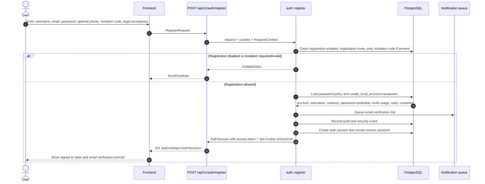
```mermaid
sequenceDiagram
    autonumber
    actor U as User
    participant FE as Frontend
    participant API as POST /api/v1/auth/register
    participant S as auth::register
    participant DB as PostgreSQL
    participant N as Notification queue

    U->>FE: Enter username, email, password, optional phone, invitation code, legal acceptance
    FE->>API: RegisterRequest
    API->>S: request + cookies + RequestContext
    S->>DB: Check registration.enabled, registration.invite_only, invitation code if present
    alt Registration disabled or invitation required/invalid
        S-->>API: FORBIDDEN
        API-->>FE: ErrorEnvelope
    else Registration allowed
        S->>DB: Load password policy and create_local_account transaction
        DB-->>S: account, username, contacts, password credential, invite usage, roles, consents
        S->>N: Queue email verification link
        S->>DB: Record audit and security event
        S->>DB: Create auth.session and revoke excess sessions
        S->>API: AuthSession with access token + Set-Cookie refresh/csrf
        API-->>FE: 201 ApiEnvelope<AuthSession>
        FE-->>U: Show signed-in state and email verification prompt
    end
```

Implementation notes:

- Requires at least one accepted legal document for public self-registration.
- Password rules are read from `auth.password.policy` and enforced server-side.
- `invitationCode` is required when `registration.invite_only` is true; invitation roles replace the default `user` role.
- Email is normalized and checked for duplicates, allowed domains, and blocked domains.
- Username is stored in `iam.account.public_handle` and normalized to lowercase.
- Login-enabled phone numbers are unique across active rows.
- Password is stored as Argon2id hash; raw password is never persisted.
- Primary email starts as `pending`; email verification is queued.
- Session issue stores only refresh-token hash in `auth.session`, sets refresh and CSRF cookies, and returns a JWT access token.

### Bootstrap Register Admin

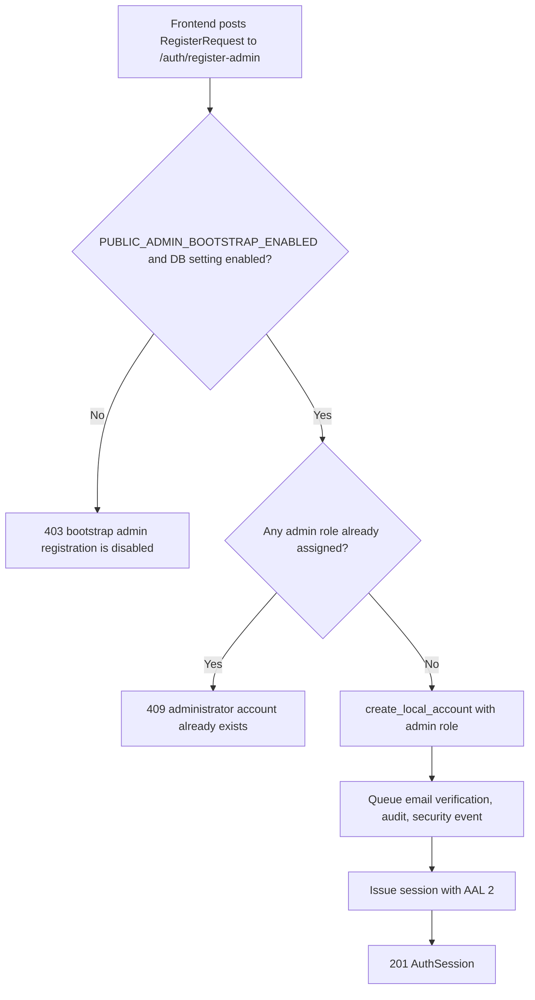
```mermaid
flowchart TD
    A[Frontend posts RegisterRequest to /auth/register-admin] --> B{PUBLIC_ADMIN_BOOTSTRAP_ENABLED and DB setting enabled?}
    B -->|No| X[403 bootstrap admin registration is disabled]
    B -->|Yes| C{Any admin role already assigned?}
    C -->|Yes| Y[409 administrator account already exists]
    C -->|No| D[create_local_account with admin role]
    D --> E[Queue email verification, audit, security event]
    E --> F[Issue session with AAL 2]
    F --> G[201 AuthSession]
```

### Login With Password

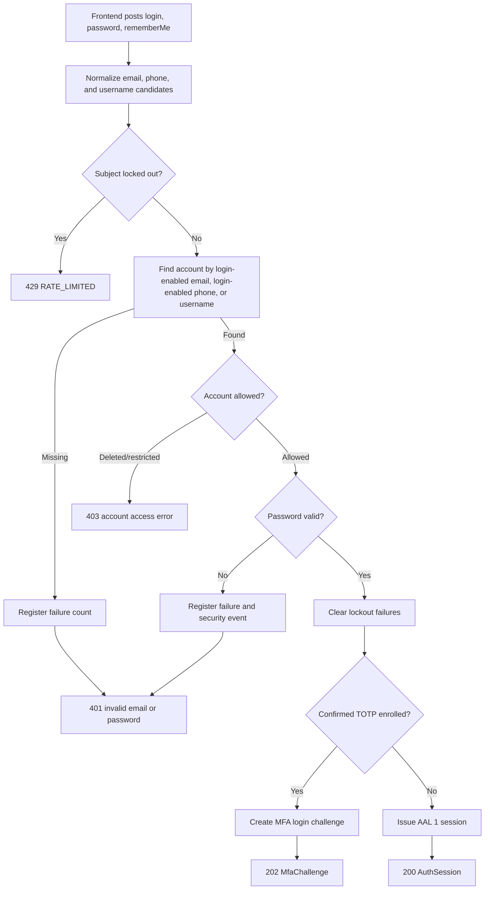
```mermaid
flowchart TD
    A[Frontend posts login, password, rememberMe] --> B[Normalize email, phone, and username candidates]
    B --> C{Subject locked out?}
    C -->|Yes| X[429 RATE_LIMITED]
    C -->|No| D[Find account by login-enabled email, login-enabled phone, or username]
    D -->|Missing| E[Register failure count]
    E --> X1[401 invalid email or password]
    D -->|Found| F{Account allowed?}
    F -->|Deleted/restricted| X2[403 account access error]
    F -->|Allowed| G{Password valid?}
    G -->|No| H[Register failure and security event]
    H --> X1
    G -->|Yes| I[Clear lockout failures]
    I --> J{Confirmed TOTP enrolled?}
    J -->|Yes| K[Create MFA login challenge]
    K --> L[202 MfaChallenge]
    J -->|No| M[Issue AAL 1 session]
    M --> N[200 AuthSession]
```

Frontend handling:

- `200` means login is complete.
- `202` means render MFA challenge UI and call `/auth/mfa/verify`.
- `data.user.security.mfaRequired && !data.user.security.totpEnabled` means show a TOTP enrollment prompt after login; it is not a failed login.

### Verify MFA Challenge

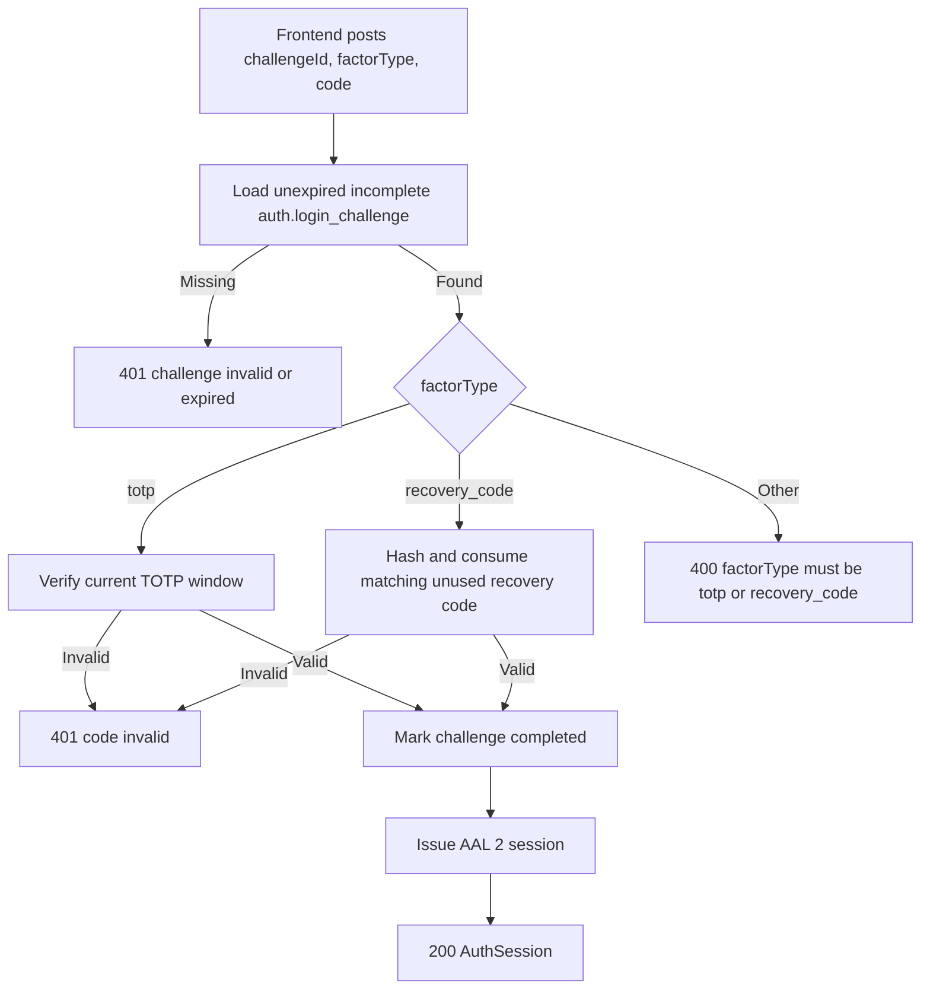
```mermaid
flowchart TD
    A[Frontend posts challengeId, factorType, code] --> B[Load unexpired incomplete auth.login_challenge]
    B -->|Missing| X[401 challenge invalid or expired]
    B -->|Found| C{factorType}
    C -->|totp| D[Verify current TOTP window]
    C -->|recovery_code| E[Hash and consume matching unused recovery code]
    C -->|Other| X1[400 factorType must be totp or recovery_code]
    D -->|Invalid| X2[401 code invalid]
    E -->|Invalid| X2
    D -->|Valid| F[Mark challenge completed]
    E -->|Valid| F
    F --> G[Issue AAL 2 session]
    G --> H[200 AuthSession]
```

### Refresh Session

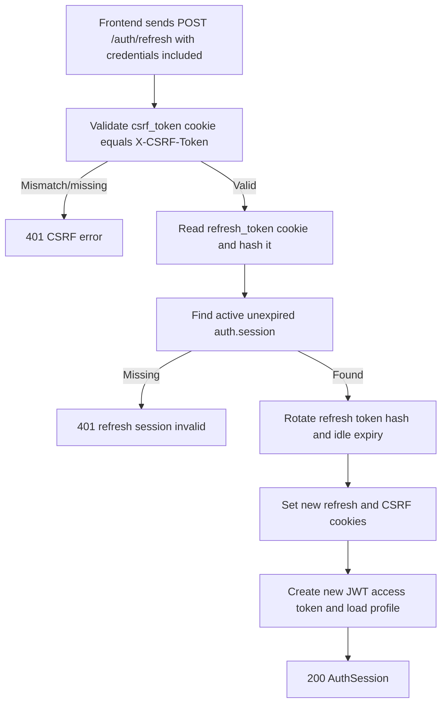
```mermaid
flowchart TD
    A[Frontend sends POST /auth/refresh with credentials included] --> B[Validate csrf_token cookie equals X-CSRF-Token]
    B -->|Mismatch/missing| X[401 CSRF error]
    B -->|Valid| C[Read refresh_token cookie and hash it]
    C --> D[Find active unexpired auth.session]
    D -->|Missing| Y[401 refresh session invalid]
    D -->|Found| E[Rotate refresh token hash and idle expiry]
    E --> F[Set new refresh and CSRF cookies]
    F --> G[Create new JWT access token and load profile]
    G --> H[200 AuthSession]
```

### Logout

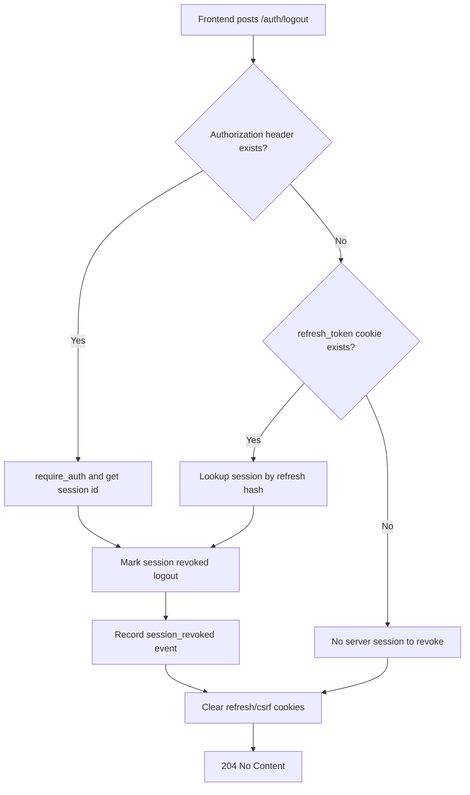
```mermaid
flowchart TD
    A[Frontend posts /auth/logout] --> B{Authorization header exists?}
    B -->|Yes| C[require_auth and get session id]
    B -->|No| D{refresh_token cookie exists?}
    D -->|Yes| E[Lookup session by refresh hash]
    D -->|No| F[No server session to revoke]
    C --> G[Mark session revoked logout]
    E --> G
    G --> H[Record session_revoked event]
    F --> I[Clear refresh/csrf cookies]
    H --> I
    I --> J[204 No Content]
```

### Change Password

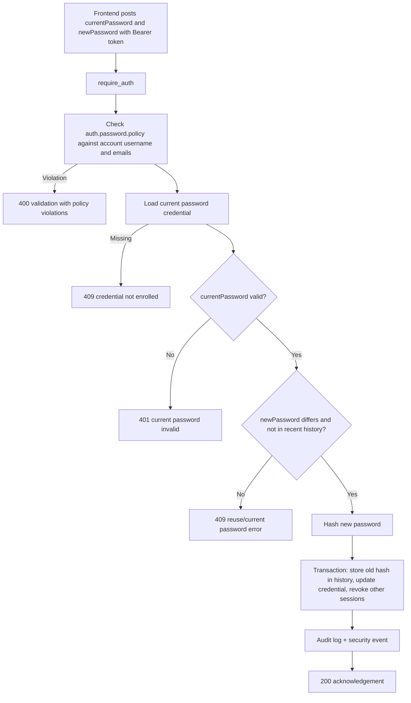
```mermaid
flowchart TD
    A[Frontend posts currentPassword and newPassword with Bearer token] --> B[require_auth]
    B --> C[Check auth.password.policy against account username and emails]
    C -->|Violation| X[400 validation with policy violations]
    C --> D[Load current password credential]
    D -->|Missing| X1[409 credential not enrolled]
    D --> E{currentPassword valid?}
    E -->|No| X2[401 current password invalid]
    E -->|Yes| F{newPassword differs and not in recent history?}
    F -->|No| X3[409 reuse/current password error]
    F -->|Yes| G[Hash new password]
    G --> H[Transaction: store old hash in history, update credential, revoke other sessions]
    H --> I[Audit log + security event]
    I --> J[200 acknowledgement]
```

### Forgot Password

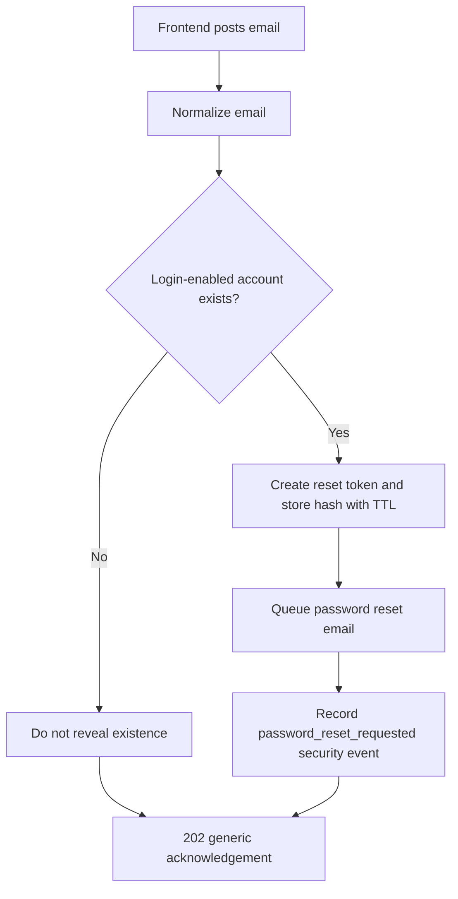
```mermaid
flowchart TD
    A[Frontend posts email] --> B[Normalize email]
    B --> C{Login-enabled account exists?}
    C -->|No| D[Do not reveal existence]
    C -->|Yes| E[Create reset token and store hash with TTL]
    E --> F[Queue password reset email]
    F --> G[Record password_reset_requested security event]
    D --> H[202 generic acknowledgement]
    G --> H
```

### Complete Password Reset

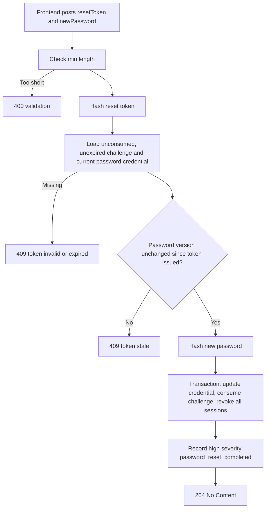
```mermaid
flowchart TD
    A[Frontend posts resetToken and newPassword] --> B[Check min length]
    B -->|Too short| X[400 validation]
    B --> C[Hash reset token]
    C --> D[Load unconsumed, unexpired challenge and current password credential]
    D -->|Missing| X1[409 token invalid or expired]
    D --> E{Password version unchanged since token issued?}
    E -->|No| X2[409 token stale]
    E -->|Yes| F[Hash new password]
    F --> G[Transaction: update credential, consume challenge, revoke all sessions]
    G --> H[Record high severity password_reset_completed]
    H --> I[204 No Content]
```

### Verify Email Link

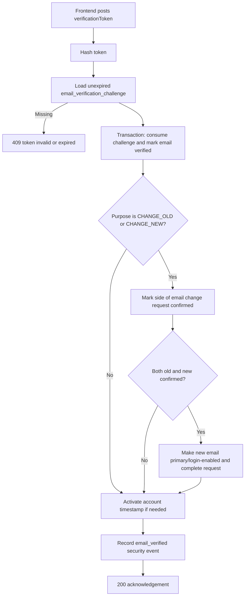
```mermaid
flowchart TD
    A[Frontend posts verificationToken] --> B[Hash token]
    B --> C[Load unexpired email_verification_challenge]
    C -->|Missing| X[409 token invalid or expired]
    C --> D[Transaction: consume challenge and mark email verified]
    D --> E{Purpose is CHANGE_OLD or CHANGE_NEW?}
    E -->|No| F[Activate account timestamp if needed]
    E -->|Yes| G[Mark side of email change request confirmed]
    G --> H{Both old and new confirmed?}
    H -->|No| F
    H -->|Yes| I[Make new email primary/login-enabled and complete request]
    I --> F
    F --> J[Record email_verified security event]
    J --> K[200 acknowledgement]
```

### Resend Primary Email Verification

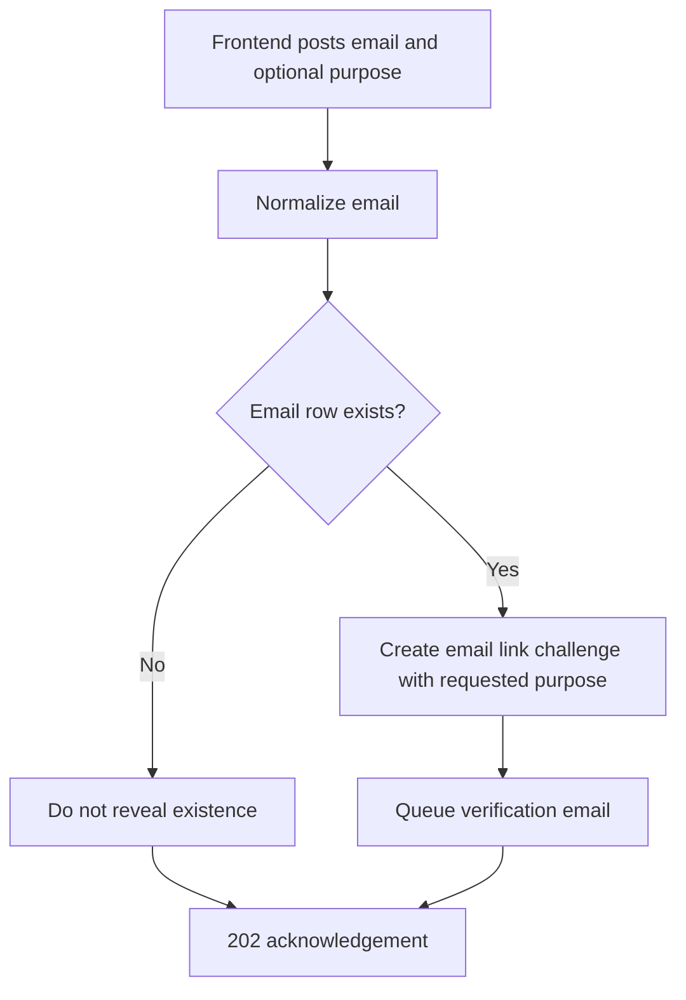
```mermaid
flowchart TD
    A[Frontend posts email and optional purpose] --> B[Normalize email]
    B --> C{Email row exists?}
    C -->|No| D[Do not reveal existence]
    C -->|Yes| E[Create email link challenge with requested purpose]
    E --> F[Queue verification email]
    D --> G[202 acknowledgement]
    F --> G
```

### Passkey Authentication Options

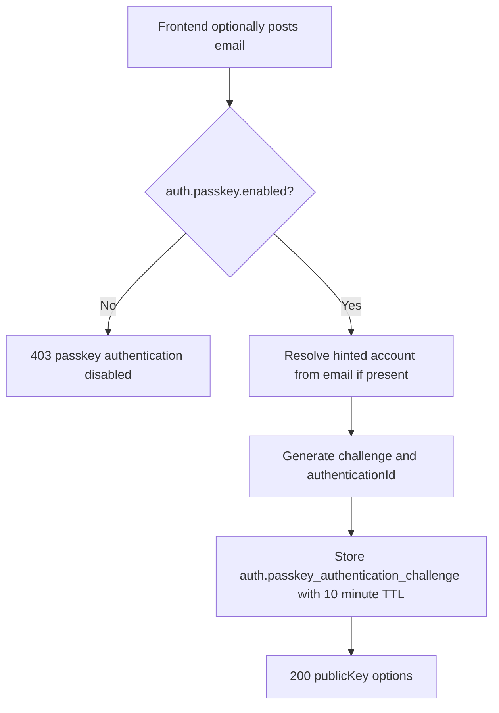
```mermaid
flowchart TD
    A[Frontend optionally posts email] --> B{auth.passkey.enabled?}
    B -->|No| X[403 passkey authentication disabled]
    B -->|Yes| C[Resolve hinted account from email if present]
    C --> D[Generate challenge and authenticationId]
    D --> E[Store auth.passkey_authentication_challenge with 10 minute TTL]
    E --> F[200 publicKey options]
```

### Verify Passkey Authentication

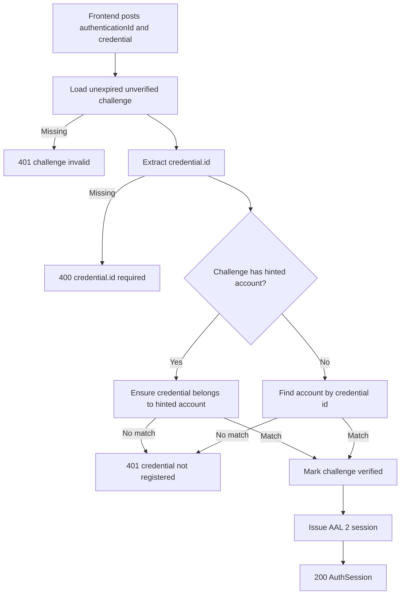
```mermaid
flowchart TD
    A[Frontend posts authenticationId and credential] --> B[Load unexpired unverified challenge]
    B -->|Missing| X[401 challenge invalid]
    B --> C[Extract credential.id]
    C -->|Missing| X1[400 credential.id required]
    C --> D{Challenge has hinted account?}
    D -->|Yes| E[Ensure credential belongs to hinted account]
    D -->|No| F[Find account by credential id]
    E -->|No match| X2[401 credential not registered]
    F -->|No match| X2
    E -->|Match| G[Mark challenge verified]
    F -->|Match| G
    G --> H[Issue AAL 2 session]
    H --> I[200 AuthSession]
```

## Profile, Account, And Session Flows

### Get Current Profile

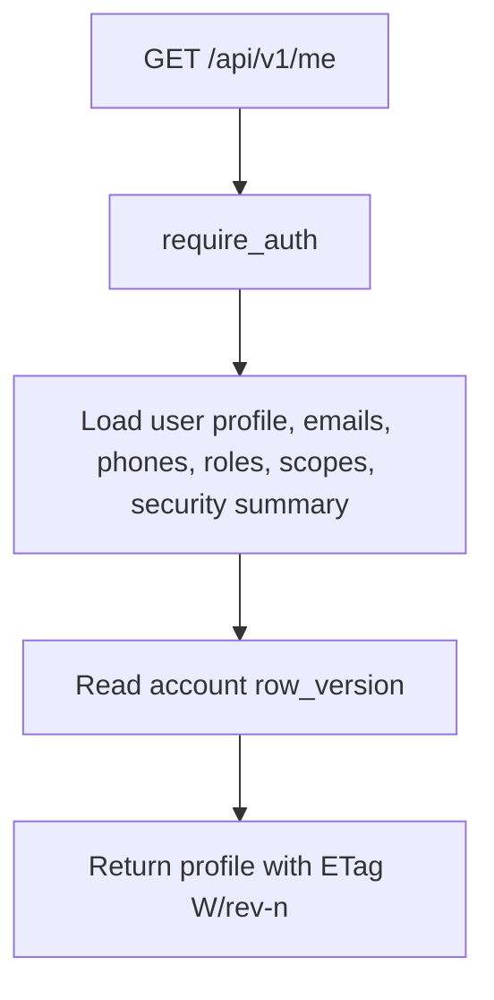
```mermaid
flowchart TD
    A[GET /api/v1/me] --> B[require_auth]
    B --> C[Load user profile, emails, phones, roles, scopes, security summary]
    C --> D[Read account row_version]
    D --> E[Return profile with ETag W/rev-n]
```

### Update Current Profile

```mermaid
flowchart TD
    A[PATCH /api/v1/me] --> B[require_auth]
    B --> C{If-Match header present?}
    C -->|Yes| D[Compare with current profile ETag]
    D -->|Mismatch| X[412 resource has been modified]
    C -->|No| E[Apply profile fields]
    D -->|Match| E
    E --> F[Bump account row_version]
    F --> G[Reload profile and ETag]
    G --> H[200 profile]
```

### Set Avatar

```mermaid
flowchart TD
    A[POST /api/v1/me/avatar with fileId] --> B[require_auth]
    B --> C{File is owned by account, purpose user_avatar, ready?}
    C -->|No| X[404 avatar file not found]
    C -->|Yes| D[Set account_profile.avatar_file_id]
    D --> E[Bump row_version]
    E --> F[Reload profile and ETag]
```

### Remove Avatar

```mermaid
flowchart TD
    A[DELETE /api/v1/me/avatar] --> B[require_auth]
    B --> C[Set avatar_file_id null]
    C --> D[Bump row_version]
    D --> E[Reload profile and ETag]
```

### Deactivate Own Account

```mermaid
flowchart TD
    A[POST /api/v1/me/account/deactivate] --> B[require_auth]
    B --> C[Verify current password]
    C -->|Invalid| X[401 current password invalid]
    C -->|Valid| D[Transaction: insert login_disabled restriction]
    D --> E{revokeOtherSessions defaults true?}
    E -->|Yes| F[Revoke active sessions]
    E -->|No| G[Keep sessions]
    F --> H[Commit]
    G --> H
    H --> I[Audit account.self_deactivated]
    I --> J[200 Account deactivated]
```

### List Own Sessions

```mermaid
flowchart TD
    A[GET /api/v1/me/sessions?cursor&limit] --> B[require_auth]
    B --> C[Decode offset cursor and clamp limit 1..100]
    C --> D[List non-revoked sessions for account]
    D --> E[Mark current session]
    E --> F[Return sessions and nextCursor if more]
```

### Revoke All Own Sessions

```mermaid
flowchart TD
    A[POST /api/v1/me/sessions/revoke-all] --> B[require_auth]
    B --> C{scope == all?}
    C -->|Yes| D[Revoke all active sessions]
    C -->|No/default others| E[Revoke active sessions except current]
    D --> F[Record session_revoked security event]
    E --> F
    F --> G[200 Sessions revoked]
```

### Revoke Own Session

```mermaid
flowchart TD
    A[DELETE /api/v1/me/sessions/{sessionId}] --> B[require_auth]
    B --> C[Update session if it belongs to account and is active]
    C -->|0 rows| X[404 session not found]
    C -->|Updated| D[Record session_revoked event]
    D --> E[204 No Content]
```

## Security, Passkey, TOTP, Email, And Phone Flows

### Get Security Summary

```mermaid
flowchart TD
    A[GET /api/v1/me/security] --> B[require_auth]
    B --> C[Check password credential, verified contacts, TOTP, passkeys, recovery codes, account MFA flag]
    C --> D[Return UserSecuritySummary]
```

### List Own Security Events

```mermaid
flowchart TD
    A[GET /api/v1/me/security/events] --> B[require_auth]
    B --> C[Decode cursor and clamp limit]
    C --> D[List account security events newest first]
    D --> E[Return events with nextCursor]
```

### Create Security Report

```mermaid
flowchart TD
    A[POST /api/v1/me/security/reports] --> B[require_auth]
    B --> C[Insert ops.security_report status open]
    C --> D[Record high severity suspicious_login_reported]
    D --> E[201 Security report created]
```

### List Passkeys

```mermaid
flowchart TD
    A[GET /api/v1/me/passkeys] --> B[require_auth]
    B --> C[List active PASSKEY authenticators]
    C --> D[Return Passkey list]
```

### Create Passkey Registration Options

```mermaid
flowchart TD
    A[POST /api/v1/me/passkeys/registration/options] --> B[require_auth]
    B --> C{auth.passkey.enabled?}
    C -->|No| X[403 passkey registration disabled]
    C -->|Yes| D[Load user profile]
    D --> E[Generate challenge and registrationId]
    E --> F[Store auth.passkey_registration_challenge with 10 minute TTL]
    F --> G[Return publicKey options]
```

### Verify Passkey Registration

```mermaid
flowchart TD
    A[POST /api/v1/me/passkeys/registration/verify] --> B[require_auth]
    B --> C[Load unexpired unverified challenge for account]
    C -->|Missing| X[400 registration challenge invalid]
    C --> D[Extract credential.id]
    D -->|Missing| X1[400 credential.id required]
    D --> E[Transaction: create PASSKEY authenticator and credential]
    E --> F[Mark registration challenge verified]
    F --> G[201 Passkey]
```

### Delete Passkey

```mermaid
flowchart TD
    A[DELETE /api/v1/me/passkeys/{passkeyId}] --> B[require_auth]
    B --> C[Revoke matching PASSKEY authenticator]
    C -->|0 rows| X[404 passkey not found]
    C -->|Updated| D[204 No Content]
```

### Create TOTP Setup

```mermaid
flowchart TD
    A[POST /api/v1/me/mfa/totp/setup] --> B[require_auth]
    B --> C[Generate 20-byte secret]
    C --> D[Build base32 secret, otpauth URI, QR SVG data URL]
    D --> E[Insert pending TOTP authenticator and factor]
    E --> F[Return TotpSetup]
```

### Enable TOTP

```mermaid
flowchart TD
    A[POST /api/v1/me/mfa/totp/enable with code] --> B[require_auth]
    B --> C[Load newest pending TOTP factor]
    C -->|Missing| X[409 setup not started]
    C --> D{Code valid in TOTP window?}
    D -->|No| X1[401 verification code invalid]
    D -->|Yes| E[Activate authenticator and confirm TOTP factor]
    E --> F[Rotate recovery codes]
    F --> G[Return updated security summary]
```

### Disable TOTP

```mermaid
flowchart TD
    A[POST /api/v1/me/mfa/totp/disable with code] --> B[require_auth]
    B --> C[Load active TOTP factor]
    C -->|Missing| X[409 TOTP not enabled]
    C --> D{Code valid?}
    D -->|No| X1[401 verification code invalid]
    D -->|Yes| E[Revoke TOTP authenticator]
    E --> F[Return updated security summary]
```

### Rotate Recovery Codes

```mermaid
flowchart TD
    A[POST /api/v1/me/mfa/recovery-codes/rotate] --> B[require_auth]
    B --> C[Generate 10 recovery codes]
    C --> D[Transaction: mark active set replaced]
    D --> E[Insert new active set and SHA256 hashes]
    E --> F[Return raw codes once]
```

### List Emails

```mermaid
flowchart TD
    A[GET /api/v1/me/emails] --> B[require_auth]
    B --> C[Load non-deleted account emails]
    C --> D[Return EmailAddress list]
```

### Add Email

```mermaid
flowchart TD
    A[POST /api/v1/me/emails] --> B[require_auth]
    B --> C[Normalize email and check uniqueness]
    C -->|Exists| X[409 email already exists]
    C -->|New| D[Insert non-primary, login-disabled, pending email]
    D --> E[Create 6 digit email OTP challenge]
    E --> F[Queue secondary email verification notification]
    F --> G[201 EmailAddress]
```

### Delete Email

```mermaid
flowchart TD
    A[DELETE /api/v1/me/emails/{emailId}] --> B[require_auth]
    B --> C[Load email ownership and primary flag]
    C -->|Missing| X[404 email not found]
    C -->|Primary| Y[400 primary email cannot be deleted]
    C -->|Secondary| D[Soft delete email]
    D --> E[204 No Content]
```

### Verify Added Email

```mermaid
flowchart TD
    A[POST /api/v1/me/emails/{emailId}/verify with code] --> B[require_auth]
    B --> C[Hash code and find unexpired email_otp challenge]
    C -->|Missing| X[401 verification code invalid]
    C -->|Found| D[Consume challenge]
    D --> E[Mark email verified]
    E --> F[Return EmailAddress]
```

### Make Email Primary

```mermaid
flowchart TD
    A[POST /api/v1/me/emails/{emailId}/make-primary] --> B[require_auth]
    B --> C{Email exists and is verified?}
    C -->|Missing| X[404 email not found]
    C -->|Unverified| Y[409 email must be verified]
    C -->|Verified| D[Transaction: clear current primary, set new primary and login-enabled]
    D --> E[Return EmailAddress]
```

### Resend Email Verification

```mermaid
flowchart TD
    A[POST /api/v1/me/emails/{emailId}/resend-verification] --> B[require_auth]
    B --> C[Ensure email belongs to account]
    C -->|Missing| X[404 email not found]
    C -->|Owned| D[Create new 6 digit email OTP challenge]
    D --> E[Queue notification]
    E --> F[202 acknowledgement]
```

### Start Primary Email Change

```mermaid
flowchart TD
    A[POST /api/v1/me/email-change-requests with newEmail] --> B[require_auth]
    B --> C[Find current primary email]
    C --> D[Normalize new email and check uniqueness]
    D -->|Exists| X[409 email already exists]
    D -->|New| E[Transaction: insert pending new email and email change request]
    E --> F[Queue old-address verification link]
    F --> G[Queue new-address verification link]
    G --> H[201 Email change flow started]
```

Completion is handled by the shared email-link verification flow: once both old and new verification links are confirmed, the new email becomes primary and login-enabled.

### List Phones

```mermaid
flowchart TD
    A[GET /api/v1/me/phones] --> B[require_auth]
    B --> C[Load non-deleted account phones]
    C --> D[Return PhoneNumber list]
```

### Add Phone

```mermaid
flowchart TD
    A[POST /api/v1/me/phones] --> B[require_auth]
    B --> C[Insert non-primary, SMS-disabled, pending phone]
    C --> D[Create 6 digit phone challenge]
    D --> E[Queue SMS notification]
    E --> F[201 PhoneNumber]
```

### Delete Phone

```mermaid
flowchart TD
    A[DELETE /api/v1/me/phones/{phoneId}] --> B[require_auth]
    B --> C[Soft delete phone owned by account]
    C -->|0 rows| X[404 phone not found]
    C -->|Updated| D[204 No Content]
```

### Verify Phone

```mermaid
flowchart TD
    A[POST /api/v1/me/phones/{phoneId}/verify with code] --> B[require_auth]
    B --> C[Hash code and find unexpired challenge owned by account]
    C -->|Missing| X[401 verification code invalid]
    C -->|Found| D[Consume challenge]
    D --> E[Mark phone verified]
    E --> F[Return PhoneNumber]
```

### Make Phone Primary

```mermaid
flowchart TD
    A[POST /api/v1/me/phones/{phoneId}/make-primary] --> B[require_auth]
    B --> C{Phone exists and is verified?}
    C -->|Missing| X[404 phone not found]
    C -->|Unverified| Y[409 phone must be verified]
    C -->|Verified| D[Transaction: clear current primary, set new primary]
    D --> E[Return PhoneNumber]
```

## File Flows

### Create File Upload Intent

```mermaid
flowchart TD
    A[Frontend posts filename, contentType, size, purpose, checksum with Idempotency-Key] --> B[require_auth]
    B --> C{Idempotency-Key present?}
    C -->|No| X[400 header required]
    C -->|Yes| D{Size 1 byte..10 MB?}
    D -->|No| X1[400 size validation]
    D -->|Yes| E[Hash idempotency key and check cached response]
    E -->|Cached| F[Return cached FileUploadIntent]
    E -->|New| G[Insert storage_object and file_asset upload_pending]
    G --> H[Sign 15 minute /internal/uploads URL]
    H --> I[Store idempotency response for 1 day]
    I --> J[201 FileUploadIntent]
```

### Internal Upload File Bytes

```mermaid
flowchart TD
    A[Frontend PUTs bytes to signed upload_url] --> B[Verify upload signature and expiry]
    B -->|Invalid| X[401 upload signature invalid or expired]
    B -->|Valid| C[Load file intent metadata]
    C -->|Missing| X1[404 file upload intent not found]
    C --> D{Size and content type match?}
    D -->|No| X2[400 upload validation]
    D -->|Yes| E[Create local storage directory]
    E --> F[Write bytes to storage path]
    F --> G[Mark file status scan_pending]
    G --> H[204 No Content]
```

### Complete File Upload

```mermaid
flowchart TD
    A[Frontend posts /files/uploads/{fileId}/complete] --> B[require_auth]
    B --> C[Load file owned by account]
    C -->|Missing| X[404 file not found]
    C --> D{Local bytes exist?}
    D -->|No| X1[409 upload not received]
    D -->|Yes| E{Size matches intent?}
    E -->|No| X2[409 size mismatch]
    E -->|Yes| F[Mark file ready and strip image metadata flag]
    F --> G[Return FileRecord]
```

### Get Own File Metadata

```mermaid
flowchart TD
    A[GET /api/v1/me/files/{fileId}] --> B[require_auth]
    B --> C[Load file owned by account and not deleted]
    C -->|Missing| X[404 file not found]
    C -->|Found| D[Return FileRecord]
```

### Get Own File Download URL

```mermaid
flowchart TD
    A[GET /api/v1/me/files/{fileId}/download] --> B[require_auth]
    B --> C[Load file owned by account]
    C -->|Missing| X[404 file not found]
    C -->|Found| D[Sign 10 minute /internal/files URL]
    D --> E[Return FileDownload]
```

### Internal Download File Bytes

```mermaid
flowchart TD
    A[Frontend GETs signed download URL] --> B[Verify download signature and expiry]
    B -->|Invalid| X[401 download signature invalid or expired]
    B -->|Valid| C[Load ready non-deleted file metadata]
    C -->|Missing| X1[404 file not found]
    C --> D[Read local bytes]
    D --> E[Return bytes with Content-Type and attachment filename]
```

## Privacy And Legal Flows

### List Legal Documents

```mermaid
flowchart TD
    A[GET /api/v1/legal/documents] --> B[Query current legal documents]
    B --> C[Return document key, title, version, effectiveAt, url]
```

### List Privacy Consents

```mermaid
flowchart TD
    A[GET /api/v1/me/privacy-consents] --> B[require_auth]
    B --> C[List granted consent records]
    C --> D[Return consent list]
```

### Create Privacy Consents

```mermaid
flowchart TD
    A[POST /api/v1/me/privacy-consents] --> B[require_auth]
    B --> C{documents non-empty and supported keys?}
    C -->|No| X[400 validation]
    C -->|Yes| D[Insert granted consent records against notice versions]
    D --> E[Reload consent list]
    E --> F[201 PrivacyConsent list]
```

### List Privacy Requests

```mermaid
flowchart TD
    A[GET /api/v1/me/privacy-requests] --> B[require_auth]
    B --> C[Decode cursor and clamp limit]
    C --> D[List account data subject requests newest first]
    D --> E[Return requests with nextCursor]
```

### Create Privacy Request

```mermaid
flowchart TD
    A[POST /api/v1/me/privacy-requests] --> B[require_auth]
    B --> C[Create data_subject_request status open]
    C --> D[Set dueAt to now plus 30 days]
    D --> E[Reload request]
    E --> F[201 PrivacyRequest]
```

### Get Privacy Request

```mermaid
flowchart TD
    A[GET /api/v1/me/privacy-requests/{privacyRequestId}] --> B[require_auth]
    B --> C[Load request owned by account]
    C -->|Missing| X[404 privacy request not found]
    C -->|Found| D[Return PrivacyRequest]
```

### Get Cookie Preferences

```mermaid
flowchart TD
    A[GET /api/v1/privacy/cookie-preferences] --> B[optional_auth]
    B --> C[Ensure cookie_subject cookie exists for anonymous subject]
    C --> D[Hash anonymous subject]
    D --> E[Load newest cookie_consent for account or anonymous hash]
    E -->|Found| F[Return stored preferences with necessary true]
    E -->|Missing| G[Return default necessary true, all optional false]
```

### Set Cookie Preferences

```mermaid
flowchart TD
    A[PUT /api/v1/privacy/cookie-preferences] --> B[optional_auth]
    B --> C[Ensure cookie_subject cookie exists]
    C --> D[Insert cookie_consent snapshot for account or anonymous hash]
    D --> E[Reload newest preferences]
    E --> F[Return CookiePreferences]
```

## Admin Flows

Every admin route uses the same guard:

```mermaid
flowchart TD
    A[Admin API request] --> B[require_auth]
    B --> C{AuthContext has admin role?}
    C -->|No| X[403 administrator access is required]
    C -->|Yes| D[Call admin service]
```

### List Roles

```mermaid
flowchart TD
    A[GET /api/v1/admin/roles] --> B[admin_auth]
    B --> C[List roles]
    C --> D[List permission codes for each role]
    D --> E[Return RoleDefinition list]
```

### Admin Overview

```mermaid
flowchart TD
    A[GET /api/v1/admin/overview] --> B[admin_auth]
    B --> C[Count accounts, statuses, admins, roles, sessions, events, audit logs, privacy requests, settings]
    C --> D[Include public_admin_bootstrap_enabled from config]
    D --> E[Return AdminOverview]
```

### List Audit Logs

```mermaid
flowchart TD
    A[GET /api/v1/admin/audit-logs?query&cursor&limit] --> B[admin_auth]
    B --> C[Decode cursor and clamp limit]
    C --> D[Search action or summary]
    D --> E[Return audit logs with nextCursor]
```

### List Security Events

```mermaid
flowchart TD
    A[GET /api/v1/admin/security/events?query&cursor&limit] --> B[admin_auth]
    B --> C[Decode cursor and clamp limit]
    C --> D[Search primary email or summary]
    D --> E[Return admin security events with nextCursor]
```

### List Admin Users

```mermaid
flowchart TD
    A[GET /api/v1/admin/users?query&status&role&cursor&limit] --> B[admin_auth]
    B --> C[Search account ids by display name, email, id, role]
    C --> D[Load admin summary for each candidate]
    D --> E[Filter by effective status if requested]
    E --> F[Apply offset cursor and limit]
    F --> G[Return users with nextCursor]
```

### Create Admin User

```mermaid
flowchart TD
    A[POST /api/v1/admin/users] --> B[admin_auth]
    B --> C[Validate roles, username, and password policy]
    C --> D{Password supplied?}
    D -->|No| E[Generate compliant initial password]
    D -->|Yes| F[Use supplied initial password]
    E --> G[create_local_account with requested roles and admin actor]
    F --> G
    G --> H{Requested status active or pending?}
    H -->|Yes/default| I[Load admin user summary]
    H -->|Other| J[Apply account status]
    J --> I
    I --> K[Return user, initialPassword, accountText]
```

### Create Admin Invitations

```mermaid
flowchart TD
    A[POST /api/v1/admin/invitations] --> B[admin_auth]
    B --> C[Validate count, maxUses, expiry, email, and roleCodes]
    C --> D[Generate one or more opaque invite codes]
    D --> E[Store only invite_code_hash with role_codes_json, max_uses, expires_at]
    E --> F[Record admin.invitation.created audit log]
    F --> G[201 invitation codes returned once]
```

### Password Policy

```mermaid
flowchart TD
    A[GET /api/v1/auth/password/policy] --> B[Load auth.password.policy setting]
    B --> C[Return frontend precheck rules]
    D[PATCH /api/v1/admin/password-policy] --> E[admin_auth]
    E --> F[Validate and persist auth.password.policy JSON]
    F --> G[Record admin.password_policy.updated audit log]
```

### Get Admin User

```mermaid
flowchart TD
    A[GET /api/v1/admin/users/{accountId}] --> B[admin_auth]
    B --> C[Load admin user summary]
    C -->|Missing| X[404 account not found]
    C -->|Found| D[Return AdminUserSummary]
```

### Update Admin User

```mermaid
flowchart TD
    A[PATCH /api/v1/admin/users/{accountId}] --> B[admin_auth]
    B --> C[Begin transaction]
    C --> D[Update username if present]
    D --> E[Update profile fields if present]
    E --> F[Upsert primary email/phone if present]
    F --> G[Replace roles if roleCodes present]
    G --> H[Set password rotation or MFA enrollment flags if present]
    H --> I[Set login disabled or account status if present]
    I --> J[Bump account row_version]
    J --> K[Commit]
    K --> L[Record admin.user.updated audit log]
    L --> M[Return AdminUserSummary]
```

### List Admin User Sessions

```mermaid
flowchart TD
    A[GET /api/v1/admin/users/{accountId}/sessions] --> B[admin_auth]
    B --> C[Decode cursor and clamp limit]
    C --> D[List active sessions for target account]
    D --> E[Return sessions with nextCursor]
```

### Revoke Admin User Sessions

```mermaid
flowchart TD
    A[POST /api/v1/admin/users/{accountId}/sessions/revoke-all] --> B[admin_auth]
    B --> C[Read scope default all]
    C --> D[Revoke active target-account sessions]
    D --> E[Record admin.user.sessions.revoked audit log]
    E --> F[200 User sessions revoked]
```

Note: current service code treats `scope == "others"` the same as revoking target-account active sessions, because an admin route has no target user's current session context.

### List Admin User Security Events

```mermaid
flowchart TD
    A[GET /api/v1/admin/users/{accountId}/security-events] --> B[admin_auth]
    B --> C[Decode cursor and clamp limit]
    C --> D[List security events filtered to target account]
    D --> E[Return events with nextCursor]
```

### List Admin User Audit Logs

```mermaid
flowchart TD
    A[GET /api/v1/admin/users/{accountId}/audit-logs] --> B[admin_auth]
    B --> C[Decode cursor and clamp limit]
    C --> D[List audit logs where actor or entity matches target account]
    D --> E[Return logs with nextCursor]
```

### Admin Verify User Email

```mermaid
flowchart TD
    A[POST /api/v1/admin/users/{accountId}/emails/{emailId}/verify] --> B[admin_auth]
    B --> C[Mark email verified if owned by target and not deleted]
    C -->|0 rows| X[404 email not found]
    C -->|Updated| D[Reload target emails]
    D --> E[Return EmailAddress]
```

### Admin Unverify User Email

```mermaid
flowchart TD
    A[POST /api/v1/admin/users/{accountId}/emails/{emailId}/unverify] --> B[admin_auth]
    B --> C[Mark email pending and clear verified_at]
    C -->|0 rows| X[404 email not found]
    C -->|Updated| D[Reload target emails]
    D --> E[Return EmailAddress]
```

### Bulk Admin User Action

```mermaid
flowchart TD
    A[POST /api/v1/admin/users/bulk-actions] --> B[admin_auth]
    B --> C[For each account id, begin transaction]
    C --> D{action}
    D -->|freeze| E[Apply frozen status restriction]
    D -->|suspend| F[Apply suspended status restriction]
    D -->|activate/restore| G[Lift restrictions and set active]
    D -->|delete| H[Soft delete account and revoke sessions]
    D -->|set-status| I[Apply provided status]
    D -->|revoke_sessions| J[Revoke account sessions]
    D -->|require_password_change| K[Set must_rotate true]
    D -->|Unsupported| X[400 unsupported bulk action]
    E --> L[Commit account transaction]
    F --> L
    G --> L
    H --> L
    I --> L
    J --> L
    K --> L
    L --> M[After loop, record admin.user.bulk_action audit log]
    M --> N[200 Bulk action accepted]
```

### List System Settings

```mermaid
flowchart TD
    A[GET /api/v1/admin/settings] --> B[admin_auth]
    B --> C[List global system settings joined with definitions]
    C --> D[Return AdminSystemSetting list]
```

### Update System Setting

```mermaid
flowchart TD
    A[PATCH /api/v1/admin/settings/{settingKey}] --> B[admin_auth]
    B --> C[Load setting by key]
    C -->|Missing| X[404 system setting not found]
    C -->|Found| D[Update value_json, updated_at, updated_by_account_id]
    D --> E[Reload setting]
    E --> F[Return AdminSystemSetting]
```

## Cross-Cutting Helper Flows

### `auth::require_auth`

```mermaid
flowchart TD
    A[Read Authorization header] --> B{Starts with Bearer?}
    B -->|No| X[401 bearer token is required/invalid]
    B -->|Yes| C[Decode JWT with JWT_SECRET]
    C -->|Invalid/expired| X1[401 token error]
    C -->|Valid| D[Check auth.session id/account id, not revoked, not expired]
    D -->|Missing| X2[401 session is no longer valid]
    D -->|Found| E[Return AuthContext account_id, session_id, roles, scopes]
```

### `auth::issue_session`

```mermaid
flowchart TD
    A[Account authenticated] --> B[Generate session id, refresh token, CSRF token]
    B --> C[Hash refresh token]
    C --> D[Load idle, absolute, concurrent session settings]
    D --> E[Revoke excess sessions]
    E --> F[Insert auth.session]
    F --> G[Set refresh_token HttpOnly cookie and csrf_token readable cookie]
    G --> H[Update account last_login_at]
    H --> I[Load roles/scopes and create JWT access token]
    I --> J[Load UserProfile]
    J --> K[Record login_success security event]
    K --> L[Return AuthSession]
```

### `services::auth::create_local_account`

```mermaid
flowchart TD
    A[Create local account request] --> B{Self-registration and no legal docs?}
    B -->|Yes| X[400 acceptedLegalDocuments required]
    B -->|No| C[Validate username and auth.password.policy]
    C --> D[Normalize email and optional phone]
    D --> E{Email, username, or login phone already exists?}
    E -->|Yes| X1[409 account already exists]
    E -->|No| F[Enforce allowed/blocked email domains]
    F --> G[Hash password]
    G --> H[Evaluate MFA enrollment policy]
    H --> I[Transaction: account, profile, contacts, password authenticator, invite use, roles, account MFA flag, legal consents]
    I --> J[Commit]
    J --> K[Queue email verification]
    K --> L[Record audit and security events]
    L --> M[Return CreatedAccount]
```

### Pagination Cursor

```mermaid
flowchart TD
    A[Route receives cursor and limit] --> B[decode_offset_cursor]
    B -->|Missing cursor| C[offset = 0]
    B -->|Invalid base64/prefix/number| X[400 cursor is invalid]
    B -->|Valid| D[offset from cursor]
    C --> E[limit default 20, clamp 1..100]
    D --> E
    E --> F[Query limit + 1 rows]
    F --> G{More rows than limit?}
    G -->|Yes| H[nextCursor = encode offset + limit]
    G -->|No| I[nextCursor = null]
```

### Notifications

```mermaid
flowchart TD
    A[Service needs email/SMS delivery] --> B[Build notification_payload]
    B --> C[Insert ops.notification status queued]
    C --> D[Insert ops.notification_delivery status queued]
    D --> E[External worker can deliver later]
```

### Audit And Security Events

```mermaid
flowchart TD
    A[Security or admin-relevant action completes] --> B{What kind of event?}
    B -->|Who changed what| C[record_audit_log into ops.audit_log]
    B -->|Risk/security timeline| D[record_security_event into ops.security_event]
    C --> E[request_id links log to response]
    D --> E
```
